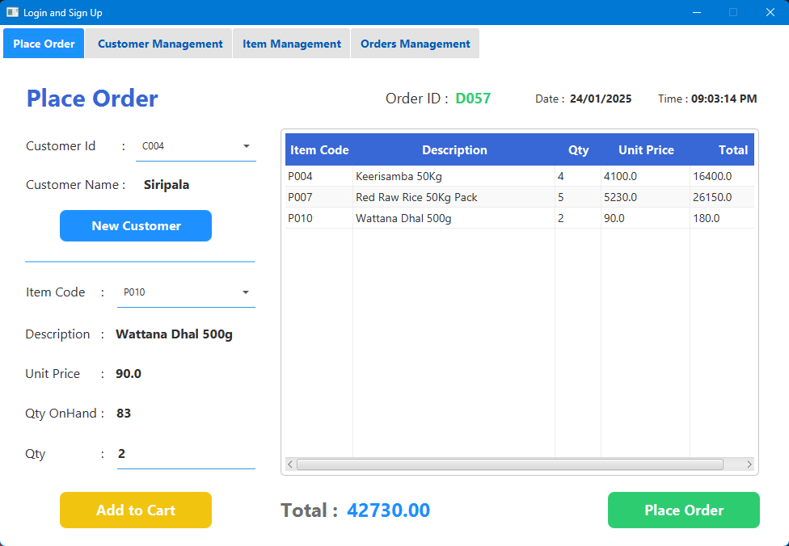

# **Thogakade JavaFX Application**

## **Overview**
The Thogakade JavaFX application is a point-of-sale system designed to streamline retail operations. It allows users to register, log in, manage items and customer details, and place orders efficiently. The application features secure password encryption and decryption, robust database connectivity using JDBC, and supports database transactions to ensure data consistency.

---

## **Features**
- **User Registration & Login**:
  - Secure user registration with password encryption.
  - User login with encrypted password verification.
- **Item Details Management (CRUD)**:
  - Add, update, delete, and view item details.
  - Search for items by name or ID.
- **Customer Details Management (CRUD)**:
  - Add, update, delete, and view customer details.
  - Search for customers by name or contact number.
- **Order Management**:
  - Place new orders by selecting items and customers.
  - Calculate order totals automatically.
  - View order history with item-wise breakdown.

---

## **Technologies Used**
- **Programming Language**: Java  
- **Framework**: JavaFX for building the user interface  
- **Database**: MySQL for storing user, item, customer, and order data  
- **Database Connectivity**: Hibernate with JPA for connecting to the MySQL database  
- **Security**: Password encryption and decryption using Java's security libraries  
- **IDE**: IntelliJ IDEA for development  
- **Build Tool**: Maven for project management  

---

## **Project Status**
- **In Progress**: The application is actively being developed and optimized with additional features and security improvements.

---

## **Usage**

### **User Management**
1. **Register User**: Create new user accounts with encrypted passwords.
2. **Login User**: Securely log in with encrypted password verification.

### **Item Details Management (CRUD)**
1. **Add Item**: Register new items with details such as name, price, and quantity.
2. **Update Item**: Modify item information, including prices and quantities.
3. **Delete Item**: Remove items from the inventory.
4. **View Items**: Display the current list of available items.

### **Customer Details Management (CRUD)**
1. **Add Customer**: Register new customers with their personal details.
2. **Update Customer**: Modify existing customer information.
3. **Delete Customer**: Remove customer details from the system.
4. **View Customers**: Display a list of all registered customers.

### **Order Management**
1. **Place Order**: Select items and customers to create new orders.
2. **View Orders**: Access order history and details for all customers.
3. **Manage Orders**: Update or delete existing orders as needed.

---

## **Database Transactions**
- The application supports database transactions to ensure data consistency. All operations involving orders, customers, and items are handled within transactions to prevent data corruption and maintain integrity.

---

## **Screenshots**
  
  
  
  

---

## **Contributing**
Contributions are welcome! To contribute to the development of this system, fork the repository, make your changes, and submit a pull request.

---

## **License**
This project is licensed under the MIT License. For more details, check the LICENSE file.

---

## **Credits**
- **Developer**: Nipun Basnayake
- **Libraries Used**:
  - JavaFX for building the graphical user interface
  - MySQL Connector for database interaction
  - Maven for project management
  - Java Security Libraries for password encryption

---

## **Contact**
For more details, questions, or contributions, feel free to contact:  
- Email: [nipunsathsara1999@gmail.com](mailto:nipunsathsara1999@gmail.com)  
- GitHub: [NipunBasnayake](https://github.com/NipunBasnayake)
